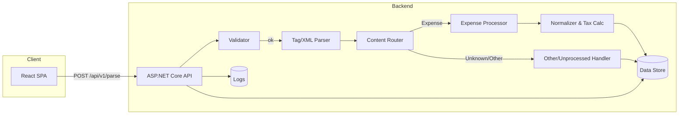

# Flowingly Parsing Service — PRD + Technical Specification (v0.3)

> Combined PRD + Tech Spec to implement a modular text-ingestion and parsing service with an initial **Expense Claim** processor and a holding path for **Other/Unprocessed** items (e.g., Restaurant Reservation). Designed for clarity, maintainability, and easy handover.

## Document History

| Version  | Date       | Summary                                                                                                                                                                                                                                                                                                                                                                                                                                                                                                                                                                                                                                                                                                                                                                                                                                                                                                                                                                     |
| -------- | ---------- | --------------------------------------------------------------------------------------------------------------------------------------------------------------------------------------------------------------------------------------------------------------------------------------------------------------------------------------------------------------------------------------------------------------------------------------------------------------------------------------------------------------------------------------------------------------------------------------------------------------------------------------------------------------------------------------------------------------------------------------------------------------------------------------------------------------------------------------------------------------------------------------------------------------------------------------------------------------------------- |
| **v0.3** | 2025-10-06 | Major update based on external review feedback. **Storage strategy** revised (**Section 8, 16, 17, 14**): SQLite for local dev/tests, Postgres for deployment stages (M5+) with migration path documented. **API response structure** changed (**Section 4.1, 6**): responses now specific (expense OR other, not combined). **Parsing rules** enhanced (**Section 4.2**): added overlapping tag validation, Banker's Rounding policy, tax rate precedence clarification, ambiguous time handling. **Testing coverage** expanded (**Section 13**): added 6 new BDD scenarios, testing matrix, sample email fixtures requirement. **Documentation** improved: Swagger examples as future enhancement (**Section 7**), M0→M2 priority guardrails (**Section 18**), two-minute reviewer path (**Section 19**), rate limiting backlog item (**Section 20.3**). Total: 12 sections modified, ~250 lines added/updated. |
| **v0.2** | 2025-10-05 | Added this history; expanded **Section 3** (Hexagonal, parsing vs normalization, CQRS-lite vs event sourcing, Ports/Adapters & DI); clarified **Section 4** (HTTP 400 rationale); hardened **Section 4.2** (secure XML, dates vs UTC); expanded **Section 5** (CORS; latency p50/p95/p99); updated **Section 6** (Redux decision, E2E vs integration, accessibility controls); enriched **Section 7** (FluentAssertions/FluentValidation/Serilog, Strategy & Pipeline examples, Swashbuckle) and added **API-key middleware**; refined **Section 8** (Postgres-only on Render, FKs/indexes/ERD, idempotency via content hash); added BDD cases in **Section 13**; added **Prometheus** note (**Section 15**); consolidated **Render-only** deployment with GitHub Integration + Blueprint and documented free-tier limits (**Section 16**); finalized **Section 17** answers; added **M0 Scaffold & Echo** milestone (**Section 18**); tightened scope in **Section 20.3**. |
| **v0.1** | 2025-10-05 | Initial combined PRD + Technical Specification.                                                                                                                                                                                                                                                                                                                                                                                                                                                                                                                                                                                                                                                                                                                                                                                                                                                                                                                             |

---

## 1. Vision & Goals

**Vision.** Provide a simple, robust API + UI to ingest free‑form text (e.g., pasted email bodies), extract structured data from **inline tags** and **XML islands**, and normalize it for downstream systems—starting with **Expense Claims**.

**Primary Goals**

* **G1**: Accept raw text, detect and validate tagged content; **reject malformed tags**.
* **G2**: Extract **Expense** fields, compute tax breakdown (from an **inclusive** total), and return normalized JSON.
* **G3**: **Modular processing** so new content types (e.g., reservations) can be added later with minimal coupling.
* **G4**: Provide a lightweight **React UI** to submit text and visualize results/errors.
* **G5**: Deliver a codebase that is **easy to understand, maintain, and extend**, with tests, docs, ADRs, and CI/CD.

**Non-Goals (initial)**

* N1: Full reservation processing (will be stored as **Other/Unprocessed** per rules for later handling).
* N2: Authentication/authorization beyond basic API key or dev-only protections (can be added later).
* N3: Complex persistence/reporting. We’ll store messages + normalized outputs + logs minimally.

---

## 2. Scope & Use Cases

**In-Scope (Phase 1)**

* Paste text containing inline tags (e.g., `<vendor>`, `<description>`, `<date>`) and/or an XML **island** (e.g., `<expense>...</expense>` with `<cost_centre>`, `<total>`, `<payment_method>`).
* Validate tag integrity: **any unclosed tag → reject**.
* Expense rules:

  * `<total>` (**incl. tax**) is **required**; else reject.
  * `<cost_centre>` **optional** → default to `UNKNOWN`.
  * Compute `total_excl_tax` & `sales_tax` from `total_incl_tax` and `taxRate`.
* Non-expense content (e.g., reservation) → persist as **Other/Unprocessed** and return a clear classification in response.

**Representative Use Cases**

* UC‑1: "Happy path" Expense extraction and tax calculation.
* UC‑2: Inline tags present, but malformed/unclosed → validation error 400.
* UC‑3: Missing `<total>` → 400.
* UC‑4: Missing `<cost_centre>` → processed with `UNKNOWN`.
* UC‑5: Text contains both expense and unrelated tags → expense extracted; unrelated stored as Other/Unprocessed.

---

## 3. High-Level Solution Architecture



**Architecture Style.** Clean/Hexagonal with small dose of CQRS:

* API (Presentation) is thin; **Domain** contains parsing/validation/normalization.
* **Command/Query** separation at handler level (no event sourcing in v1).
* **Ports/Adapters**: Repositories/Parsers/Processors are interfaces with DI-backed implementations.

**Hexagonal (Ports & Adapters) in a nutshell.** The core **Domain** holds the business rules (parsing, normalization, tax logic). It talks to the outside world through **ports** (interfaces). **Adapters** implement those ports for specific technologies (e.g., EF Core repository for Postgres, web controller for HTTP). This decouples domain logic from frameworks and I/O.

**Why chosen**

* Keeps business logic independent of infrastructure (easier to test and swap implementations).
* Clear seams for **Dependency Injection (DI)** and mocking in tests.
* Supports adding new processors (e.g., a reservation module) without touching transport/storage details.

**Alternatives considered**

* **Layered (N‑tier):** simple, but tends to leak infra concerns into the domain over time.
* **Microservices:** overkill for a single bounded context in v1; adds ops complexity.
* **Event‑sourced service:** strong audit trail but higher operational/cognitive overhead than needed here.

**Parsing vs Normalization**

* **Parsing** = extract structure from raw text (e.g., find `<total>` and read it as a decimal).
* **Normalization** = clean/standardize parsed values (strip commas/`$`, parse dates → ISO, compute tax breakdown, format time as `HH:mm`).

**Command/Query (CQRS‑lite)**

* We separate **commands** (state‑changing operations like “parse & store”) from **queries** (reads). In v1, commands run synchronously and we don’t split read/write models or databases.

**Event Sourcing (not used in v1)**

* Event sourcing stores an append‑only log of domain events (e.g., `MessageParsed`, `ExpenseComputed`) and rebuilds state from them. Pros: auditability and temporal queries; Cons: projections, replay, and idempotency complexity. Our needs are met by straightforward persistence + logs for now.

**Ports/Adapters & DI‑backed implementations**

* **Ports** = interfaces the domain depends on (e.g., `IMessageRepository`, `IExpenseProcessor`).
* **Adapters** = concrete tech implementations (EF Core repo, HTTP controller) that plug into ports.
* **DI‑backed** = adapters are registered in the DI container; the app wires them at runtime and tests can inject fakes/mocks.

---

## 4. Functional Specification

### 4.1 API

* **POST** `/api/v1/parse`

  * Request

    ```json
    {
      "text": "string (required)",
      "taxRate": 0.15,          // optional; default from config
      "currency": "NZD"        // optional; default from config
    }
    ```
  * Success `200`

**Response Structure**: Responses are **specific to input context**. If classified as `expense`, response contains `expense` block only. If classified as `other`, response contains `other` block only. Never both in the same response.

**For Expense Content**:
    ```json
    {
      "classification": "expense",
      "expense": {
        "cost_centre": "DEV632|UNKNOWN",
        "payment_method": "personal card",
        "total_incl_tax": 35000.00,
        "tax_rate": 0.15,
        "sales_tax": 4565.22,
        "total_excl_tax": 30434.78,
        "currency": "NZD",
        "source": "expense-xml|inline"
      },
      "meta": {
        "warnings": [],
        "tags_found": ["expense","total","cost_centre"],
        "correlation_id": "guid"
      }
    }
    ```

**For Other/Unprocessed Content**:
    ```json
    {
      "classification": "other",
      "other": {
        "raw_tags": ["vendor","description","date"],
        "note": "Stored as Other/Unprocessed for future processors"
      },
      "meta": {
        "warnings": [],
        "tags_found": ["vendor","description","date"],
        "correlation_id": "guid"
      }
    }
    ```
  * Errors `400`

    * `UNCLOSED_TAGS` { details: ["vendor","date"] }
    * `MISSING_TOTAL` { details: {} }
    * `EMPTY_TEXT` { details: {} }

**Why 400 (Bad Request)?** These validation failures are **client‑side issues** (malformed/unbalanced tags, missing required fields). The server is healthy and understood the request format, but the **request content is invalid**, so we return **HTTP 400** with a machine‑readable error.

### 4.2 Parsing & Validation Rules

* **Tag Integrity**: stack-based scan over `<name>` and `</name>`; must be balanced & properly nested.
  - **Tag Overlap**: reject improperly nested/overlapping tags (e.g., `<a><b></a></b>` is invalid)
  - Stack-based parser ensures closing tags match most recent opening tag
  - Example valid: `<a><b></b></a>`
  - Example invalid: `<a><b></a></b>` → error `UNCLOSED_TAGS` or `MALFORMED_TAGS`
* **XML Islands**: extract `<expense>...</expense>` blocks and parse with **secure XML settings** to prevent **XXE** and related attacks:

  * Use a hardened parser: `DtdProcessing = Prohibit`, `XmlResolver = null`.
  * Bound input sizes and timeouts; only parse the delimited island content.
  * Optionally validate against **Expense.xsd** (config‑toggle) to enforce required elements and types.
* **Inline Tags**: allow `vendor|description|date|total|cost_centre|payment_method` (extensible via config).
* **Precedence**: prefer `<total>` within `<expense>` island; else first global `<total>`.
* **Tax Rate Precedence**: Request `taxRate` parameter wins over config default; if request omits `taxRate`, use config value; if both absent, **fail with error code `MISSING_TAXRATE`** or fallback to 0.15 (config-toggled behavior via `Parsing:StrictTaxRate`).
  - Example: Request has `taxRate: 0.10` → use 0.10 (ignores config)
  - Example: Request omits `taxRate`, config has `0.15` → use 0.15
  - Example: Request omits `taxRate`, config absent, `StrictTaxRate: true` → error 400 `MISSING_TAXRATE`
  - Example: Request omits `taxRate`, config absent, `StrictTaxRate: false` → fallback to 0.15 (default)
* **Normalization**:

  * Numbers: strip commas/currency symbols, parse as decimal, **round using Banker's Rounding (MidpointRounding.ToEven)** at 2 decimal places for all monetary values.
    - **Banker's Rounding**: 0.5 rounds to nearest even number (unbiased over many operations)
    - Examples: 2.125 → 2.12, 2.135 → 2.14, 2.145 → 2.14, 2.155 → 2.16
    - Applied at business boundaries: tax calculation, total computations
  * Date: attempt ISO and common natural formats → `yyyy-MM-dd`.
  * Time: if present, attempt parsing to `HH:mm` format. **Ignore ambiguous times** (e.g., "7.30pm" with unclear separators, "19:30" without context) if not reliably detectable; log warning and omit time field in response.
    - Accept unambiguous formats: "19:30", "7:30 PM", "07:30"
    - Reject/ignore: "7.30pm" (dot separator ambiguous), partial times without clear AM/PM
  * **Dates vs UTC**: Business dates (like reservation/receipt dates) are **calendar dates**, not instants; we store them as date‑only. Audit fields (e.g., `received_at`) are stored in **UTC** (`TIMESTAMPTZ`) so server/DB clocks are consistent.

---

## 5. Non-Functional Requirements (NFR)

* **Security**: Harden XML parser; optional API key; CORS restricted to known origins; input size limits; rate-limiting (basic token bucket via middleware).
* **Performance**: Streaming reads where feasible; async I/O; minimal allocations; response within 200ms p50 on small payloads.
* **Reliability**: Clear error contracts; idempotent storage keyed by content hash (optional).
* **Observability**: Structured logging w/ Correlation ID; minimal prometheus-friendly metrics (requests, failures, durations).
* **Config**: App‑wide and per‑module settings via `appsettings*.json` + environment variables; hot reload in dev.
* **Docs & Handover**: README, ADR log, Dev Onboarding, API docs (Swagger), and Test How‑To.

**CORS (Cross‑Origin Resource Sharing).** Browsers block JS calls across origins unless the server opts in. We **restrict allowed origins** to our UI domain(s) so random sites can’t call our API via a user’s browser.

**Latency terminology.** “**200 ms p50**” means median requests finish in ≤200 ms. We’ll watch **p95/p99** tails to ensure acceptable worst‑case latencies.

---

## 6. Frontend (React) — Design & Implementation

**Stack**: React + Vite + TypeScript + Playwright (E2E).

**UI Features**

* Textarea (paste raw text), Submit, Clear.
* JSON viewer displays either expense details OR other/unprocessed details based on classification (responses are specific, not combined)
* Error banner showing `error.code` and friendly message.
* Footer: correlation ID shown for support.

**State & API**

* Minimal state with React Query or fetch wrapper.
* `.env` for API base URL.
* **Redux?** Not needed in v1; the app has a single form/result flow. Redux adds ceremony without benefit here.

**Testing**

* Unit: utility functions (formatting).
* E2E (Playwright):

  * Happy path parses expense.
  * Unclosed tag shows error.
  * Missing total shows error.
* **E2E vs Integration:** E2E drives a real browser against the running API (full flow). Backend **integration tests** run the API in‑process and assert endpoint behavior without a real browser.

**Accessibility**

* Labels for inputs; focus management on error; keyboard friendly.
* **User controls:** optional toggles for **high‑contrast mode** and **text size** (normal/large/x‑large), persisted in `localStorage`.

---

## 7. Backend (ASP.NET Core) — Design & Implementation

**Stack**: .NET 8, Minimal API/Controllers, xUnit, FluentAssertions, FluentValidation, Serilog, EF Core.

**Library notes**

* **FluentAssertions**: expressive, readable test assertions (e.g., `result.Should().BeEquivalentTo(expected)`).
* **FluentValidation**: declarative validators for DTOs (e.g., `RuleFor(x => x.Text).NotEmpty()`).
* **Serilog**: structured, enriched logging (free & open‑source) with many sinks (console, Seq, etc.).

**Layering**

```
/src
  Api            -> Endpoints, DI, Swagger, Middleware
  Application    -> Commands/Queries, Validators, Handlers
  Domain         -> Parsers, Value Objects, Calculators, Interfaces (Ports)
  Infrastructure -> EF Core, Repos (Adapters), Logging, Config
/contracts      -> Request/Response DTOs shared with tests
```

**Key Components**

* `ITagValidator` (stack-based integrity check)
* `IXmlIslandExtractor` (secure XML parsing)
* `IInlineTagExtractor` (regex-based tag reads)
* `IContentRouter` chooses processor strategy
* `IExpenseProcessor` (Strategy) → `ExpenseProcessor`
* `IOtherProcessor` → `OtherProcessor`
* `INormalizer` (numbers, dates, times)
* `ITaxCalculator`
* `IMessageRepository`, `IExpenseRepository`, `IProcessingLogRepository`

**Patterns**

* **Strategy** for processor selection per classification. *Example:* `IProcessor` with concrete `ExpenseProcessor`, `OtherProcessor`; router picks the strategy.
* **Pipeline** inside each processor: `Validate → Extract → Normalize → Persist → BuildResponse`. Steps are small/testable; we can insert XSD validation via config.
* **Repository** for data persistence isolation.
* **CQRS‑lite**: command handler `ParseMessageCommandHandler`, query handlers for retrieval (future).
* **Factory** for extracting the right parser chain by content type.

**Swagger (OpenAPI)** — *What & Why*

* **What**: Machine-readable interface description of the API (endpoints, schemas, examples).
* **Why**:

  * Human-friendly UI to **try endpoints** in the browser.
  * **Single source of truth** for request/response contracts.
  * Enables **client SDK generation** and API diffing/versioning.
  * Improves onboarding: new devs see the API surface instantly.
* **How**: Add `Swashbuckle.AspNetCore`, call `AddEndpointsApiExplorer()` + `AddSwaggerGen()`, and use `UseSwagger()` + `UseSwaggerUI()` in Development.

**Swagger Examples (Future Enhancement — Post M0→M2)**

After core functionality (M0→M2) is delivered, enhance Swagger UI with:
- **Example Requests/Responses**: Use `[SwaggerRequestExample]` and `[SwaggerResponseExample]` attributes to show sample JSON for common scenarios
- **Reusable Config Cases**: Make examples accessible from demo app UI (user can choose scenario, execute via Swagger)
- **Scenarios**: Happy path expense, missing total error, overlapping tags error, tax rate precedence

This improves onboarding but is deferred to avoid scope creep during core delivery.

**API key middleware (Prod)**

```csharp
app.Use(async (context, next) =>
{
    // Skip in Development
    var env = context.RequestServices.GetRequiredService<IHostEnvironment>();
    if (env.IsDevelopment()) { await next(); return; }

    var configuredKey = context.RequestServices
        .GetRequiredService<IConfiguration>()
        ["Security:ApiKey"];

    var provided = context.Request.Headers["X-API-Key"].FirstOrDefault();
    if (string.IsNullOrWhiteSpace(configuredKey) || provided == configuredKey)
    {
        await next();
    }
    else
    {
        context.Response.StatusCode = StatusCodes.Status401Unauthorized;
        await context.Response.WriteAsJsonAsync(new { error = new { code = "UNAUTHORIZED", message = "Invalid API key." } });
    }
});
```

---

## 8. Data Model & Persistence

**Storage Decision (updated v0.3)**

* **SQLite** for **local development** and **unit/integration tests** (fast, hermetic, no external dependencies)
* **PostgreSQL on Render** for **later deployment stages** (production-ready when ready to deploy)
* **Migration path**: EF Core migrations ensure schema compatibility; test SQLite schema against Postgres before deployment

**Rationale**: Given time constraints, SQLite provides fastest iteration locally while ensuring we can migrate to Postgres when hitting deployment milestones. This maximizes agility for M0→M2 delivery.

**SQLite Considerations**:
- Use file-based or in-memory SQLite for tests (hermetic, no setup required)
- Limit advanced Postgres-specific features (e.g., full JSONB operations) or abstract them behind repository interface
- Ensure EF Core migrations work with both providers (test on Postgres before production deployment)

**Postgres Deployment Notes** (for later stages)

* **Render Managed PostgreSQL**: Versions **13–17** available for new instances; connection URLs exposed via dashboard
* **Migration from SQLite**:
  1. Run EF Core migrations against Postgres instance to create schema
  2. Verify schema matches SQLite version (no drift)
  3. Update connection string in production config
  4. Deploy to Render with Postgres connection
* **Testing**: Run integration tests against Postgres before production deployment to catch provider-specific issues

**Schema (initial)**

```sql
-- Raw inbound messages
CREATE TABLE messages (
  id UUID PRIMARY KEY,
  received_at TIMESTAMPTZ NOT NULL DEFAULT now(),
  correlation_id UUID NOT NULL,
  content TEXT NOT NULL,
  content_hash TEXT NOT NULL,
  classification TEXT NOT NULL CHECK (classification IN ('expense','other'))
);

-- Normalized expense outputs
CREATE TABLE expenses (
  id UUID PRIMARY KEY,
  message_id UUID NOT NULL REFERENCES messages(id) ON DELETE CASCADE,
  cost_centre TEXT NOT NULL,
  payment_method TEXT,
  total_incl_tax NUMERIC(18,2) NOT NULL,
  tax_rate NUMERIC(5,4) NOT NULL,
  sales_tax NUMERIC(18,2) NOT NULL,
  total_excl_tax NUMERIC(18,2) NOT NULL,
  currency TEXT NOT NULL,
  source TEXT NOT NULL,
  created_at TIMESTAMPTZ NOT NULL DEFAULT now()
);

-- Other/unprocessed payload capture
CREATE TABLE other_payloads (
  id UUID PRIMARY KEY,
  message_id UUID NOT NULL REFERENCES messages(id) ON DELETE CASCADE,
  raw_tags JSONB,
  note TEXT,
  created_at TIMESTAMPTZ NOT NULL DEFAULT now()
);

-- Processing logs (auditable pipeline steps)
CREATE TABLE processing_logs (
  id UUID PRIMARY KEY,
  message_id UUID NOT NULL REFERENCES messages(id) ON DELETE CASCADE,
  step TEXT NOT NULL,
  level TEXT NOT NULL,
  details JSONB,
  created_at TIMESTAMPTZ NOT NULL DEFAULT now()
);
```

**Indexes**

* `messages(content_hash)` for idempotency (recommend unique index to dedupe inserts).
* `expenses(message_id)`.
* `processing_logs(message_id, created_at)`.

**Relationships & Constraints**

* `expenses.message_id` → `messages.id` (FK, `ON DELETE CASCADE`).
* `other_payloads.message_id` → `messages.id` (FK).
* `processing_logs.message_id` → `messages.id` (FK).

**ERD**

* Add a simple diagram in README (Mermaid/dbdiagram) showing `messages` 1→1 `expenses` and 1→N `processing_logs`/`other_payloads`.

**Idempotency via content hash**

* We compute a stable hash (e.g., SHA‑256) of inbound `content`. On insert, use a **unique index** on `content_hash` to avoid duplicate processing and make retries safe.

**Migrations**

* EF Core migrations committed to repo; `dotnet ef database update` targets **Render Postgres** using env var `ConnectionStrings__Default`.

---

## 9. Configuration Strategy

**Files & Overlays**

* `appsettings.json` (base), `appsettings.Development.json`, `appsettings.Production.json`.
* **Module-specific** overlays under `./config/modules/*.json` (e.g., `expense.json`).

**Example**

```json
{
  "App": {
    "DefaultCurrency": "NZD",
    "DefaultTaxRate": 0.15,
    "AllowedOrigins": ["http://localhost:5173"]
  },
  "Parsing": {
    "KnownTags": ["expense","total","vendor","description","date","cost_centre","payment_method"],
    "MaxPayloadBytes": 262144
  },
  "Modules": {
    "Expense": {
      "Enabled": true,
      "TotalPrecedence": ["island","inline"]
    },
    "Other": { "Enabled": true }
  }
}
```

**Decision**: Keep **app-wide** and **module-specific** distinct **sections** in the same file for simplicity, with optional per-module JSON files for advanced deployments. Document both options.

---

## 10. Validation: XML Schema (XSD) — Is it useful?

* **For strict islands** like `<expense>...</expense>` XSD can enforce element presence/types (e.g., `<total>` required, numeric). Pros: strong validation, clearer errors. Cons: adds complexity, doesn’t help **inline** tag validation.
* **Decision**: Adopt a **lightweight XSD** for the `<expense>` island only. **Enabled by default** for v1; toggle via config (`Parsing.UseExpenseXsd = false`) to disable if needed. Keep inline tags governed by our integrity + regex rules. Provide `Expense.xsd`.

---

## 11. Security & OWASP Mapping

**API Threat Surface** (OWASP API Security Top 10)

* API1:2019 Broken Object Level Authorization → *N/A in v1* (no object fetch by ID exposed yet).
* API2:2019 Broken User Auth → Use API key or gateway in prod; rotate keys; HTTPS only.
* API3:2019 Excessive Data Exposure → Minimal response; don’t echo raw content back unless needed.
* API4:2019 Lack of Rate Limiting → Add rate limiter middleware (IP/API key based).
* API5:2019 Broken Function Level Auth → Single endpoint; future endpoints gated.
* API6:2019 Mass Assignment → DTO allow‑lists; ignore unknown fields.
* API7:2019 Security Misconfig → Disable XML DTD/XXE; strict CORS; headers; version pinning.
* API8:2019 Injection → Parameterized SQL via EF; no raw SQL; sanitize/validate inputs.
* API9:2019 Improper Asset Mgmt → Versioned routes `/api/v1/*`; deprecations documented.
* API10:2019 Insufficient Logging & Monitoring → Structured logs + correlation id; surface 4xx/5xx counts.

**Classic OWASP Top 10 (2021) notes**

* A01: Broken Access Control (future auth); A03 Injection; A05 Security Misconfiguration; A06 Vulnerable/Outdated Components; A07 IDOR (N/A v1); A09 Security Logging.

---

## 12. Performance, Versioning & API Design

* **Versioning**: URI version `/api/v1`; plan `/api/v2` when breaking changes arise. Also include an `x-api-version` response header.
* **Serialization**: System.Text.Json configured for camelCase; ignore nulls; strict number handling.
* **Compression**: Enable response compression.
* **Caching**: POST responses are not cached; if we add GET queries later, use ETags/Cache-Control.
* **Pagination**: N/A v1; plan for query endpoints.

---

## 13. TDD/BDD Plan

**Core Test Inventory (just enough)**

* **Domain Unit**

  * Tag integrity valid/invalid (nested, repeated, partial).
  * Tag overlap validation (e.g., `<a><b></a></b>` → reject as `MALFORMED_TAGS`)
  * XML island extraction (present/absent, malformed rejected upstream).
  * Inline tag extraction (non-greedy, multiple occurrences).
  * Number/date/time normalization variants.
  * Rounding policy tests (verify Banker's Rounding: 2.125 → 2.12, 2.135 → 2.14, edge cases)
  * Tax calculator (rounding edges).
* **Application/Integration**

  * POST `/api/v1/parse` → 200 happy path (expense).
  * POST with unclosed tag → 400 UNCLOSED_TAGS.
  * POST with missing `<total>` → 400 MISSING_TOTAL.
  * POST w/out `<cost_centre>` → 200 cost_centre=`UNKNOWN`.
  * POST with explicit taxRate → uses request value (ignores config)
  * POST without taxRate, config has default → uses config default
  * POST without taxRate, no config default, strict mode → 400 MISSING_TAXRATE
  * POST without taxRate, no config default, fallback mode → uses 0.15
* **UI E2E (Playwright)**

  * **Sample Email 1** (from brief — Expense with XML island): Submit → verify correct extraction, tax calculation, cost_centre handling
  * **Sample Email 2** (from brief — Expense with inline tags): Submit → verify correct extraction, field parsing
  * Submit invalid input (unclosed tags) → sees error banner with clear error code
  * Submit missing total → sees error banner with `MISSING_TOTAL`

**E2E Test Coverage**: Implement E2E tests using the **exact sample emails** from the original brief (`Full Stack Engineer Test (Sen) V2.pdf`, pages X-Y) to ensure complete scenario coverage and parity with requirements.

**Sample BDD (Gherkin)**

```gherkin
Feature: Parse expense text
  Scenario: Happy path extraction and tax calc
    Given a text with a valid <expense> island and inline tags
    When I POST it to /api/v1/parse
    Then the response status is 200
    And the classification is "expense"
    And total_excl_tax and sales_tax are correctly computed

  Scenario: Missing total should error
    Given text without a <total> tag
    When I POST it to /api/v1/parse
    Then the response status is 400
    And the error code is "MISSING_TOTAL"

  Scenario: Unclosed tag should error
    Given text with "<vendor>Seaside" and no closing tag
    When I POST it to /api/v1/parse
    Then the response status is 400
    And the error code is "UNCLOSED_TAGS"

  Scenario: Missing cost_centre defaults to UNKNOWN
    Given text with <expense><total>35000</total></expense>
    When I POST it to /api/v1/parse
    Then the response status is 200
    And the expense.cost_centre is "UNKNOWN"

  Scenario: Total precedence prefers island value
    Given text with <total>100</total> and <expense><total>115</total></expense>
    When I POST it to /api/v1/parse
    Then expense.total_incl_tax is 115.00

  Scenario: Number normalization handles commas
    Given text with <expense><total>35,000</total></expense>
    When I POST it
    Then expense.total_incl_tax is 35000.00

  Scenario: Date normalization
    Given text with <date>27 April 2022</date>
    When I POST it
    Then reservation.date_iso is "2022-04-27"

  Scenario: Overlapping tags should error
    Given text with "<vendor><description></vendor></description>"
    When I POST it to /api/v1/parse
    Then the response status is 400
    And the error code is "UNCLOSED_TAGS" or "MALFORMED_TAGS"
    And the error details list the problematic tags

  Scenario: Rounding follows Banker's Rounding
    Given text with <expense><total>100.125</total></expense>
    When I POST it with taxRate 0.15
    Then expense.total_incl_tax is 100.12
    And sales_tax is computed with Banker's Rounding applied
    And total_excl_tax is computed with Banker's Rounding applied

  Scenario: Request taxRate overrides config
    Given config has defaultTaxRate 0.15
    When I POST with taxRate 0.10
    Then expense.tax_rate is 0.10

  Scenario: Missing taxRate uses config default
    Given config has defaultTaxRate 0.15
    When I POST without taxRate parameter
    Then expense.tax_rate is 0.15

  Scenario: Missing taxRate with strict mode errors
    Given config has no defaultTaxRate and StrictTaxRate is true
    When I POST without taxRate parameter
    Then the response status is 400
    And the error code is "MISSING_TAXRATE"
```

**Testing Matrix**

| Scenario | Unit Test | Integration Test | E2E Test |
|----------|-----------|------------------|----------|
| Tag overlap validation | ✓ Domain | ✓ API endpoint | - |
| Rounding policy (Banker's) | ✓ TaxCalculator | ✓ Full pipeline | - |
| Tax rate precedence | ✓ Validator | ✓ API endpoint | - |
| Sample Email 1 (XML island) | - | ✓ Parsing + DB | ✓ UI + API |
| Sample Email 2 (Inline tags) | - | ✓ Parsing + DB | ✓ UI + API |
| Unclosed tags error | ✓ TagValidator | ✓ API 400 response | ✓ Error banner |
| Missing total error | ✓ ExpenseProcessor | ✓ API 400 response | ✓ Error banner |

**Legend**: ✓ = Required test coverage, - = Not applicable/needed

---

**Test Fixtures**: Store both sample emails from the brief as fixtures in `/fixtures/sample-email-1.txt` and `/fixtures/sample-email-2.txt` for use in E2E and integration tests.

---

## 14. ADRs & Implementation Logs

* **ADRs** under `/docs/adr/` as numbered markdown files.

  * ADR‑0001: **Storage choice → SQLite (local/test), Postgres (deployment)**
  * ADR‑0002: Architecture style (Clean+CQRS‑lite)
  * ADR‑0003: Processor Strategy pattern
  * ADR‑0004: Swagger for API contract & onboarding
  * ADR‑0005: Versioning via URI
  * ADR‑0006: **Platform choice → Render for API (Docker), UI (Static Site), and DB (Postgres)**
* **Build Log** under `/docs/logs/BUILDLOG.md` (date, change summary, rationale).

---

## 15. DevEx & Observability

* **Logging**: Serilog with `Correlation-Id` middleware; enrich logs with route, status, latency.
* **Metrics**: ASP.NET meters (requests/sec, p50/p95 latency, error rate). Optional Prometheus exporter.
* **Error Model**: `{ error: { code, message, details }, correlation_id }` → FE shows code + human message.

**Prometheus (optional).** A **free, open‑source** metrics system/time‑series DB. Apps expose a `/metrics` endpoint; Prometheus scrapes it and you can visualize with Grafana. Not required for the demo but easy to add later.

---

## 16. Deployment & DevOps

**Platform Decision (updated)**

* Use **Render** for **all layers**:

  * **API**: Render **Web Service** using **Docker** for ASP.NET Core.
  * **UI**: Render **Static Site** (Vite React) served via CDN.
  * **DB**: **Render PostgreSQL** (single database for Prod). Dev runs locally against Postgres.

**Why Render works for this stack**

* .NET/ASP.NET Core is supported via Dockerized Web Services; React builds as a Static Site; managed Postgres with versions 13–17.

**Deployment model**

* **Dev** runs **locally** with **SQLite** (file-based or in-memory) for rapid iteration and hermetic tests
  - No external database dependencies for local development
  - Tests run fast and isolated (no shared state between test runs)
* **Prod** in Render with **PostgreSQL** when ready for deployment (M5+ milestones)
  - Linked to `main` branch
  - Managed Postgres instance provisioned via Render dashboard
* Use **Render GitHub Integration** and a **Blueprint (**``**)** for simple, declarative deploys.
* Document **free‑tier limits** in README (build minutes, instance sleep, bandwidth, Postgres storage) to set expectations for reviewers.

**SQLite → Postgres Migration Path**

1. **Development**: Use SQLite for all local work and tests
2. **Pre-Deployment Validation** (M4/M5):
   - Provision Render Postgres instance
   - Run EF Core migrations: `dotnet ef database update --connection "PostgresConnectionString"`
   - Execute integration test suite against Postgres
   - Verify schema parity with SQLite version
3. **Deployment** (M5+):
   - Update production config with Postgres connection string
   - Deploy API to Render Web Service
   - Run smoke tests

**Render Service Config (example)**

* `render.yaml` to declare services:

  * web service `flowingly-api` (Dockerfile, env `ConnectionStrings__Default`, `ASPNETCORE_URLS`)
  * static site `flowingly-ui` (build: `npm ci && npm run build`, publish: `dist`)
  * postgres `flowingly-db` (provisioned in dashboard; expose connection URL as secret)

**Environments**

* **Local Dev**: permissive CORS to `http://localhost:5173`, Swagger enabled, API key disabled.
* **Prod (Render)**: CORS locked to UI domain; API key required; health checks enabled; minimal logs.

## 17. Open Questions (for Product/Tech Decisions)

**Answers (v1)**

1. **Tax/Currency:** Default **GST 0.15**, **NZD**.
2. **Reservation Phase 2:** Out‑of‑scope for v1; stored as `other` only.
3. **Prod Auth (API key):** **Enabled.** Demonstrates production hygiene (prevents casual misuse; enables per‑key rate limiting). Entails: generate secret key (env), check `X-API-Key` in middleware, return 401 on fail.
4. **Latency & payload ceilings:** Target **p50 ≤ 200 ms**, **p95 ≤ 500 ms**, **p99 ≤ 800 ms** for payloads ≤ **256 KB**.
5. **XSD:** **Enabled by default** for `<expense>` island; toggle via config.
6. **Storage:** **SQLite for local dev/tests**; **Postgres for later deployment stages** (M5+). Migration path via EF Core ensures compatibility.
7. **Versioning:** Prefer **URI versioning** (`/api/v1`) for simplicity and readability. (Media‑type versioning uses `Accept: application/vnd.app.v1+json`—flexible but heavier for this demo.)
8. **Logging retention:** default **30 days** (configurable at `Logging:RetentionDays`).

## 18. Delivery Plan (Milestones)

**Priority & Risk Guardrails**

Focus on **M0 → M2** (scaffold, tests, API v1) before investing in UI enhancements or advanced features. This ensures:
- Core parsing, validation, normalization logic is solid and reviewable
- API contract is stable and tested
- Backend functionality can be demonstrated via Swagger (even if UI is minimal)

UI polish (M3), persistence (M4), and deployment (M5) are sequential dependencies; prioritize backend quality over UI aesthetics for handover/review.

* **M0 (Scaffold & Echo)**: Minimal end‑to‑end scaffold. A basic UI can send text; backend stores it and echoes `"Processed receipt Input: [text]"`. Establishes Docker, configs, DI, EF migration, health checks.
* **M1 (Skeleton & Tests)**: Repo structure, CI on PRs, Domain tests for validator/parser/calculator.
* **M2 (API v1)**: `/api/v1/parse` implemented, integration tests green, Swagger docs.
* **M3 (UI v1)**: React SPA wired to local API, Playwright happy/error paths.
* **M4 (Persistence)**: Postgres schema + migrations; store messages/expenses/logs.
* **M5 (Ops)**: Prod deploy to Render, smoke tests, add rate limiting, API key.
* **M6 (Release)**: Harden config, finalize docs, tag `v1.0.0`.

---

## 19. Handover & Onboarding

* **README** with:
  - **Quick Reviewer Path** (2-minute guide for evaluators):
    1. Clone repo: `git clone <repo-url>`
    2. Run local setup: `docker-compose up` (or `dotnet run` if SQLite)
    3. Open Swagger UI: `http://localhost:5001/swagger`
    4. Test sample request (copy-paste from Swagger examples)
    5. View result in Swagger response panel
  - **Developer Quick Start**: Detailed local development setup
  - Architecture overview, endpoints, config, and runbooks
  - Troubleshooting common issues
* **Swagger** at `/swagger` (Dev) with example requests.
* **Docs** folder: ADRs + Build Log + Test How‑To.
* **Code**: consistent foldering, DI registration in `Startup/Program`, comments where intent is non-obvious.

---

## 20. Appendix

### 20.1 Example Inline/Island Inputs

* See sample fixture files under `/fixtures/` for tests and manual UX checks.

### 20.2 Error Codes

* `UNCLOSED_TAGS`, `MISSING_TOTAL`, `EMPTY_TEXT`, `INVALID_XML`, `UNSUPPORTED_MEDIA_TYPE` (future), `INTERNAL_ERROR`.

### 20.3 Future Enhancements

We intentionally **de‑scope Phase 2** items (reservation processing, webhooks, SDKs) to focus v1 on Expense and the modular processor framework.

* **Rate Limiting**: Per-IP or per-API-key rate limiting using token bucket or sliding window middleware (backlog for post-v1). Prevents abuse and ensures fair usage. Implementation options: ASP.NET Core rate limiting middleware, custom middleware with distributed cache.
