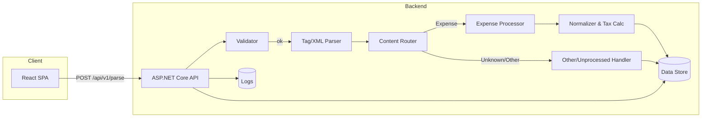

# Flowingly Parsing Service — PRD + Technical Specification (v0.1)


> Combined PRD + Tech Spec to implement a modular text-ingestion and parsing service with an initial **Expense Claim** processor and a holding path for **Other/Unprocessed** items (e.g., Restaurant Reservation). Designed for clarity, maintainability, and easy handover.

---
## Verision History

| Version | Date | Changes | Updated by |
| --- | --- | --- | --- |
| 0.1 | 5 Oct 2025 | Initial Specification drafted. | Adarsh |


---

## 1. Vision & Goals

**Vision.** Provide a simple, robust API + UI to ingest free‑form text (e.g., pasted email bodies), extract structured data from **inline tags** and **XML islands**, and normalize it for downstream systems—starting with **Expense Claims**.

**Primary Goals**

* **G1**: Accept raw text, detect and validate tagged content; **reject malformed tags**.
* **G2**: Extract **Expense** fields, compute tax breakdown (from an **inclusive** total), and return normalized JSON.
* **G3**: **Modular processing** so new content types (e.g., reservations) can be added later with minimal coupling.
* **G4**: Provide a lightweight **React UI** to submit text and visualize results/errors.
* **G5**: Deliver a codebase that is **easy to understand, maintain, and extend**, with tests, docs, ADRs, and CI/CD.

**Non-Goals (initial)**

* N1: Full reservation processing (will be stored as **Other/Unprocessed** per rules for later handling).
* N2: Authentication/authorization beyond basic API key or dev-only protections (can be added later).
* N3: Complex persistence/reporting. We’ll store messages + normalized outputs + logs minimally.

---

## 2. Scope & Use Cases

**In-Scope (Phase 1)**

* Paste text containing inline tags (e.g., `<vendor>`, `<description>`, `<date>`) and/or an XML **island** (e.g., `<expense>...</expense>` with `<cost_centre>`, `<total>`, `<payment_method>`).
* Validate tag integrity: **any unclosed tag → reject**.
* Expense rules:

  * `<total>` (**incl. tax**) is **required**; else reject.
  * `<cost_centre>` **optional** → default to `UNKNOWN`.
  * Compute `total_excl_tax` & `sales_tax` from `total_incl_tax` and `taxRate`.
* Non-expense content (e.g., reservation) → persist as **Other/Unprocessed** and return a clear classification in response.

**Representative Use Cases**

* UC‑1: "Happy path" Expense extraction and tax calculation.
* UC‑2: Inline tags present, but malformed/unclosed → validation error 400.
* UC‑3: Missing `<total>` → 400.
* UC‑4: Missing `<cost_centre>` → processed with `UNKNOWN`.
* UC‑5: Text contains both expense and unrelated tags → expense extracted; unrelated stored as Other/Unprocessed.

---

## 3. High-Level Solution Architecture



**Architecture Style.** Clean/Hexagonal with small dose of CQRS:

* API (Presentation) is thin; **Domain** contains parsing/validation/normalization.
* **Command/Query** separation at handler level (no event sourcing in v1).
* **Ports/Adapters**: Repositories/Parsers/Processors are interfaces with DI-backed implementations.

---

## 4. Functional Specification

### 4.1 API

* **POST** `/api/v1/parse`

  * Request

    ```json
    {
      "text": "string (required)",
      "taxRate": 0.15,          // optional; default from config
      "currency": "NZD"        // optional; default from config
    }
    ```
  * Success `200`

    ```json
    {
      "classification": "expense|other",
      "expense": {
        "cost_centre": "DEV632|UNKNOWN",
        "payment_method": "personal card",
        "total_incl_tax": 35000.00,
        "tax_rate": 0.15,
        "sales_tax": 4565.22,
        "total_excl_tax": 30434.78,
        "currency": "NZD",
        "source": "expense-xml|inline"
      },
      "other": {
        "raw_tags": ["vendor","description","date"],
        "note": "Stored as Other/Unprocessed for future processors"
      },
      "meta": {
        "warnings": [],
        "tags_found": ["expense","total","vendor","description","date"],
        "correlation_id": "guid"
      }
    }
    ```
  * Errors `400`

    * `UNCLOSED_TAGS` { details: ["vendor","date"] }
    * `MISSING_TOTAL` { details: {} }
    * `EMPTY_TEXT` { details: {} }

### 4.2 Parsing & Validation Rules

* **Tag Integrity**: stack-based scan over `<name>` and `</name>`; must be balanced & properly nested.
* **XML Islands**: extract `<expense>...</expense>` blocks and parse with secure XML settings (no DTD/XXE).
* **Inline Tags**: allow `vendor|description|date|total|cost_centre|payment_method` (extensible via config).
* **Precedence**: prefer `<total>` within `<expense>` island; else first global `<total>`.
* **Normalization**:

  * Numbers: strip commas/currency symbols, parse as decimal, 2‑dp rounding at business boundaries.
  * Date: attempt ISO and common natural formats → `yyyy-MM-dd`.
  * Time: if present, output `HH:mm`.

---

## 5. Non-Functional Requirements (NFR)

* **Security**: Harden XML parser; optional API key; CORS restricted to known origins; input size limits; rate-limiting (basic token bucket via middleware).
* **Performance**: Streaming reads where feasible; async I/O; minimal allocations; response within 200ms p50 on small payloads.
* **Reliability**: Clear error contracts; idempotent storage keyed by content hash (optional).
* **Observability**: Structured logging w/ Correlation ID; minimal prometheus-friendly metrics (requests, failures, durations).
* **Config**: App‑wide and per‑module settings via `appsettings*.json` + environment variables; hot reload in dev.
* **Docs & Handover**: README, ADR log, Dev Onboarding, API docs (Swagger), and Test How‑To.

---

## 6. Frontend (React) — Design & Implementation

**Stack**: React + Vite + TypeScript + Playwright (E2E).

**UI Features**

* Textarea (paste raw text), Submit, Clear.
* JSON viewer for result.
* Error banner showing `error.code` and friendly message.
* Footer: correlation ID shown for support.

**State & API**

* Minimal state with React Query or fetch wrapper.
* `.env` for API base URL.

**Testing**

* Unit: utility functions (formatting).
* E2E (Playwright):

  * Happy path parses expense.
  * Unclosed tag shows error.
  * Missing total shows error.

**Accessibility**

* Labels for inputs; focus management on error; keyboard friendly.

---

## 7. Backend (ASP.NET Core) — Design & Implementation

**Stack**: .NET 8, Minimal API/Controllers, xUnit, FluentAssertions, FluentValidation, Serilog, EF Core.

**Layering**

```
/src
  Api            -> Endpoints, DI, Swagger, Middleware
  Application    -> Commands/Queries, Validators, Handlers
  Domain         -> Parsers, Value Objects, Calculators, Interfaces (Ports)
  Infrastructure -> EF Core, Repos (Adapters), Logging, Config
/contracts      -> Request/Response DTOs shared with tests
```

**Key Components**

* `ITagValidator` (stack-based integrity check)
* `IXmlIslandExtractor` (secure XML parsing)
* `IInlineTagExtractor` (regex-based tag reads)
* `IContentRouter` chooses processor strategy
* `IExpenseProcessor` (Strategy) → `ExpenseProcessor`
* `IOtherProcessor` → `OtherProcessor`
* `INormalizer` (numbers, dates, times)
* `ITaxCalculator`
* `IMessageRepository`, `IExpenseRepository`, `IProcessingLogRepository`

**Patterns**

* **Strategy** for processor selection per classification.
* **Pipeline** inside each processor (Validate → Extract → Normalize → Persist → BuildResponse).
* **Repository** for data persistence isolation.
* **CQRS-lite**: command handler `ParseMessageCommandHandler`, query handlers for retrieval (future).
* **Factory** for extracting the right parser chain by content type.

**Swagger (OpenAPI)** — *What & Why*

* **What**: Machine-readable interface description of the API (endpoints, schemas, examples).
* **Why**:

  * Human-friendly UI to **try endpoints** in the browser.
  * **Single source of truth** for request/response contracts.
  * Enables **client SDK generation** and API diffing/versioning.
  * Improves onboarding: new devs see the API surface instantly.
* **How**: Add Swashbuckle; annotate endpoints & schemas; host at `/swagger` in dev.

---

## 8. Data Model & Persistence

**Storage Options**

* **Dev**: SQLite (simple, file-based, great local DX).
* **Prod**: Serverless Postgres (e.g., **Neon**, **Render Postgres free**, **Fly Postgres Lite**) for durability.

**Schema (initial)**

```sql
-- Raw inbound messages
CREATE TABLE messages (
  id UUID PRIMARY KEY,
  received_at TIMESTAMPTZ NOT NULL DEFAULT now(),
  correlation_id UUID NOT NULL,
  content TEXT NOT NULL,
  content_hash TEXT NOT NULL,
  classification TEXT NOT NULL CHECK (classification IN ('expense','other'))
);

-- Normalized expense outputs
CREATE TABLE expenses (
  id UUID PRIMARY KEY,
  message_id UUID NOT NULL REFERENCES messages(id) ON DELETE CASCADE,
  cost_centre TEXT NOT NULL,
  payment_method TEXT,
  total_incl_tax NUMERIC(18,2) NOT NULL,
  tax_rate NUMERIC(5,4) NOT NULL,
  sales_tax NUMERIC(18,2) NOT NULL,
  total_excl_tax NUMERIC(18,2) NOT NULL,
  currency TEXT NOT NULL,
  source TEXT NOT NULL,
  created_at TIMESTAMPTZ NOT NULL DEFAULT now()
);

-- Other/unprocessed payload capture
CREATE TABLE other_payloads (
  id UUID PRIMARY KEY,
  message_id UUID NOT NULL REFERENCES messages(id) ON DELETE CASCADE,
  raw_tags JSONB,
  note TEXT,
  created_at TIMESTAMPTZ NOT NULL DEFAULT now()
);

-- Processing logs (auditable pipeline steps)
CREATE TABLE processing_logs (
  id UUID PRIMARY KEY,
  message_id UUID NOT NULL REFERENCES messages(id) ON DELETE CASCADE,
  step TEXT NOT NULL,
  level TEXT NOT NULL,
  details JSONB,
  created_at TIMESTAMPTZ NOT NULL DEFAULT now()
);
```

**Indexes**

* `messages(content_hash)` for idempotency.
* `expenses(message_id)`.
* `processing_logs(message_id, created_at)`.

**Migrations**

* EF Core migrations committed to repo; use `dotnet ef` in CI.

---

## 9. Configuration Strategy

**Files & Overlays**

* `appsettings.json` (base), `appsettings.Development.json`, `appsettings.Production.json`.
* **Module-specific** overlays under `./config/modules/*.json` (e.g., `expense.json`).

**Example**

```json
{
  "App": {
    "DefaultCurrency": "NZD",
    "DefaultTaxRate": 0.15,
    "AllowedOrigins": ["http://localhost:5173"]
  },
  "Parsing": {
    "KnownTags": ["expense","total","vendor","description","date","cost_centre","payment_method"],
    "MaxPayloadBytes": 262144
  },
  "Modules": {
    "Expense": {
      "Enabled": true,
      "TotalPrecedence": ["island","inline"]
    },
    "Other": { "Enabled": true }
  }
}
```

**Decision**: Keep **app-wide** and **module-specific** distinct **sections** in the same file for simplicity, with optional per-module JSON files for advanced deployments. Document both options.

---

## 10. Validation: XML Schema (XSD) — Is it useful?

* **For strict islands** like `<expense>...</expense>` XSD can enforce element presence/types (e.g., `<total>` required, numeric). Pros: strong validation, clearer errors. Cons: adds complexity, doesn’t help **inline** tag validation.
* **Decision**: Adopt a **lightweight XSD** for the `<expense>` island only (optional switch). Keep inline tags governed by our integrity + regex rules. Provide `Expense.xsd` and enable via config (`Parsing.UseExpenseXsd = true`).

---

## 11. Security & OWASP Mapping

**API Threat Surface** (OWASP API Security Top 10)

* API1:2019 Broken Object Level Authorization → *N/A in v1* (no object fetch by ID exposed yet).
* API2:2019 Broken User Auth → Use API key or gateway in prod; rotate keys; HTTPS only.
* API3:2019 Excessive Data Exposure → Minimal response; don’t echo raw content back unless needed.
* API4:2019 Lack of Rate Limiting → Add rate limiter middleware (IP/API key based).
* API5:2019 Broken Function Level Auth → Single endpoint; future endpoints gated.
* API6:2019 Mass Assignment → DTO allow‑lists; ignore unknown fields.
* API7:2019 Security Misconfig → Disable XML DTD/XXE; strict CORS; headers; version pinning.
* API8:2019 Injection → Parameterized SQL via EF; no raw SQL; sanitize/validate inputs.
* API9:2019 Improper Asset Mgmt → Versioned routes `/api/v1/*`; deprecations documented.
* API10:2019 Insufficient Logging & Monitoring → Structured logs + correlation id; surface 4xx/5xx counts.

**Classic OWASP Top 10 (2021) notes**

* A01: Broken Access Control (future auth); A03 Injection; A05 Security Misconfiguration; A06 Vulnerable/Outdated Components; A07 IDOR (N/A v1); A09 Security Logging.

---

## 12. Performance, Versioning & API Design

* **Versioning**: URI version `/api/v1`; plan `/api/v2` when breaking changes arise. Also include an `x-api-version` response header.
* **Serialization**: System.Text.Json configured for camelCase; ignore nulls; strict number handling.
* **Compression**: Enable response compression.
* **Caching**: POST responses are not cached; if we add GET queries later, use ETags/Cache-Control.
* **Pagination**: N/A v1; plan for query endpoints.

---

## 13. TDD/BDD Plan

**Core Test Inventory (just enough)**

* **Domain Unit**

  * Tag integrity valid/invalid (nested, repeated, partial).
  * XML island extraction (present/absent, malformed rejected upstream).
  * Inline tag extraction (non-greedy, multiple occurrences).
  * Number/date/time normalization variants.
  * Tax calculator (rounding edges).
* **Application/Integration**

  * POST `/api/v1/parse` → 200 happy path (expense).
  * POST with unclosed tag → 400 UNCLOSED_TAGS.
  * POST with missing `<total>` → 400 MISSING_TOTAL.
  * POST w/out `<cost_centre>` → 200 cost_centre=`UNKNOWN`.
* **UI E2E (Playwright)**

  * Submit happy path → sees expense summary.
  * Submit invalid → sees error banner.

**Sample BDD (Gherkin)**

```gherkin
Feature: Parse expense text
  Scenario: Happy path extraction and tax calc
    Given a text with a valid <expense> island and inline tags
    When I POST it to /api/v1/parse
    Then the response status is 200
    And the classification is "expense"
    And total_excl_tax and sales_tax are correctly computed

  Scenario: Missing total should error
    Given text without a <total> tag
    When I POST it to /api/v1/parse
    Then the response status is 400
    And the error code is "MISSING_TOTAL"
```

---

## 14. ADRs & Implementation Logs

* **ADRs** under `/docs/adr/` as numbered markdown files.

  * ADR‑0001: Storage choice (SQLite dev / Postgres prod)
  * ADR‑0002: Architecture style (Clean+CQRS‑lite)
  * ADR‑0003: Processor Strategy pattern
  * ADR‑0004: Swagger for API contract & onboarding
  * ADR‑0005: Versioning via URI
* **Build Log** under `/docs/logs/BUILDLOG.md` (date, change summary, rationale).

---

## 15. DevEx & Observability

* **Logging**: Serilog with `Correlation-Id` middleware; enrich logs with route, status, latency.
* **Metrics**: ASP.NET meters (requests/sec, p50/p95 latency, error rate). Optional Prometheus exporter.
* **Error Model**: `{ error: { code, message, details }, correlation_id }` → FE shows code + human message.

---

## 16. Deployment & DevOps

**Recommended Free/Low-Cost Stack**

* **API**: Fly.io or Render free tier (containerized .NET 8). Fly often offers always-on small VMs.
* **DB**: **Neon** (serverless Postgres free) for persistent prod storage.
* **UI**: Netlify (React build) or Vercel.

**CI/CD (GitHub Actions)**

* Triggers: PR → build & test (no deploy); merge to `main` → deploy **Dev**; tag `v*` → deploy **Prod**.
* Jobs:

  1. **Backend**: setup .NET, restore, build, test, publish; docker build & push; deploy via `flyctl` or Render YAML.
  2. **Frontend**: node install, typecheck, test, build; deploy to Netlify/Vercel with token.
  3. **DB**: run EF migrations against Neon (Dev/Prod) via connection strings in environment secrets.

**Environments**

* **Dev**: public but rate-limited; permissive CORS to localhost.
* **Prod**: CORS locked; API key required; logging at info; debug off.

---

## 17. Open Questions (for Product/Tech Decisions)

1. **Default tax rate & currency**: Assume NZ GST 0.15 and `NZD`?
2. **Reservation processing**: For Phase 2, which fields constitute MVP (vendor/date/time/party_size)?
3. **Auth**: Should Prod require an **API key** header from day one?
4. **P99 Targets**: Any explicit latency targets and payload size ceilings?
5. **XSD**: Turn on by default for `<expense>` island, or keep off initially?
6. **Storage**: OK with Neon Postgres for Prod, SQLite for Dev?
7. **Versioning**: URI-only or also support media-type header versioning?
8. **Logging retention**: Any specific policy (days or size)?

---

## 18. Delivery Plan (Milestones)

* **M1 (Skeleton & Tests)**: Repo structure, CI on PRs, Domain tests for validator/parser/calculator.
* **M2 (API v1)**: `/api/v1/parse` implemented, integration tests green, Swagger docs.
* **M3 (UI v1)**: React SPA wired to Dev API, Playwright happy/error paths.
* **M4 (Persistence)**: EF schema + migrations; store messages/expenses/logs.
* **M5 (Ops)**: Deploy Dev (API/UI/DB), smoke tests, add rate limiting.
* **M6 (Prod)**: Harden config, API key, deploy Prod, tag `v1.0.0`.

---

## 19. Handover & Onboarding

* **README** with: quick start (dev), architecture overview, endpoints, config, and runbooks.
* **Swagger** at `/swagger` (Dev) with example requests.
* **Docs** folder: ADRs + Build Log + Test How‑To.
* **Code**: consistent foldering, DI registration in `Startup/Program`, comments where intent is non-obvious.

---

## 20. Appendix

### 20.1 Example Inline/Island Inputs

* See sample fixture files under `/fixtures/` for tests and manual UX checks.

### 20.2 Error Codes

* `UNCLOSED_TAGS`, `MISSING_TOTAL`, `EMPTY_TEXT`, `INVALID_XML`, `UNSUPPORTED_MEDIA_TYPE` (future), `INTERNAL_ERROR`.

### 20.3 Future Enhancements

* Additional processors: Reservation, Travel, Purchase Orders.
* Async ingestion via queue; webhook callbacks.
* SDKs generated from OpenAPI (TS/C#).
